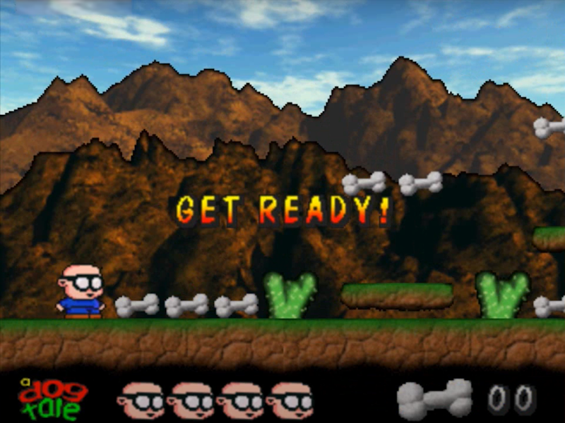

# A Dog Tale

This is the source code for a game demo I wrote for the [Net Yaroze](https://en.wikipedia.org/wiki/Net_Yaroze) way back in 1997, called A Dog Tale. **Demo** being the key word here. In fact the whole thing only started because I wanted to write some code to do [parallax scrolling](https://en.wikipedia.org/wiki/Parallax_scrolling), and it kind of grew from there. 

Before I knew it Sony were looking for examples of Net Yaroze game demos to promote the platform so I submitted it. But let's be clear upfront - it's a *terrible* game. Like I said it's not even really a game, it's just a demo of some ideas I was playing around with, but that's not how people perceived and of course judged it. It is however a great example of how old code never really dies.





You may know the game as it was subsequently published on the cover CD of the Official UK Playstation Magazine (Issue 28) in January 1998, as well as a wide range of other magazines and Sony promotional disks for the Net Yaroze programme globally.

Being a hoarder of stuff, I still have the copy of the magazine and the cover disc that went with it. Although I no longer have a Playstation to play it on.


If you're not familiar with niche development consoles from a quarter of a century ago, [The Net Yaroze was a development kit for the original Playstation](https://www.eurogamer.net/the-story-of-yaroze-sonys-first-indie-push), released by Sony in 1997. It was essentially a black Playstation One with a different boot ROM, that came with a Sony SDK, a collection of manuals, and the ability to communicate with it over a serial connection. It was only available to hobbyists by applying to the programme, and cost a whopping £750. But it offered a way to write games for dedicated hardware that didn't exist outside of the significantly more expensive blue professional developer kits, albeit in a more limited way. It was Sony's attempt to inject some indie spirit into the Playstation, and console gaming generally and I think it was pretty successful at that.


Thing is, mostly this code was written late at night, often after I'd had a few cans of cider (I coined the ficticious company name 'CiderLogic' in my head at the time), and it was also written as I was just starting out on a career in software engineering. So to say it's not the best-written or the most well-structured code in the world is something of an understatement. But I've left it as it was written at the time, because it's important to understand when enough is enough.

Is it a good game? No, it's absolutely terrible. The jumping is devoid of any kind of gravity, the level is far too hard, and the controls are shocking. I thought I was being clever making it so tricky, but apparantly that just makes a game hard to play and really frustrating.

But it is a great example of how old code never dies. Through the love of retro gaming and the power of emulation, people are still playing it and commenting on it, which I find hilarious. Even up until quite recently I was still getting contacted by people who had played it back in the day, and wanted to know more about it.

For some reason over the years people have taken to recording videos of themselves playing it and uploading them on YouTube. There are dozens of them, which to be honest I find a little weird for something I didn't spend much time on. Here's one example (click the image to play):

[](https://www.youtube.com/watch?v=vncKnRu5YAM "ACRetro - Official UK PlayStation Magazine - Net Yaroze - A Dog Tale")

Back in 2015 [somebody even wrote an article about it](https://killscreen.com/previously/articles/dog-tale-or-death-mystery/) which was something of a surprise. So I thought I'd put it up on GitHub for anyone who wants to take a look at what's going on behind the curtain.

The question is looking back, should I feel embarassed by the quality of the coding and how bad the game is? No not at all. It's a fair reflection of my abilities at the time, and importantly it was good enough to do what I wanted to achieve. I guess if you wanted to be reminicent about it, you could say it's a snapshot of an era when I was just starting out on my career, and I was still learning. But of course the role of a software engineer is to always be learning, so I guess not much has changed.

To me it's kind of a time capsule. You can sense the joy and hope in the original project readme.txt:

#  
> _This was my first finished game, and very proud of it I am too!_
>
> _This version is slightly different from the first release as I have made it slightly easier and fixed a couple of small bugs, after some friendly advice from a few individuals._
>
> _I hadn't planned to work on this game anymore, after I finished it, but I did a bit of work with it so SCEE could put it on the demo CD for the Official Playstation Magazine (Issue 28), so I thought I'd re- release this version to everybody else too, together with the source code._
>
> _The source code is a bit messy, and by no means optimised, I just wrote it off the cuff as I went along and it all just worked so I never changed anything. There are some good bits and some bits I will be changing in newer games, but this will stay as is._
>
> _Feel free to use parts of the source code for whatever you want, all I ask is that you mail me to let me know, and put a thank you in your program if you can._
>
> _Ira Rainey - 7/11/97_
#  

Even better is the scrolling message (which isn't available in all versions of the game as Sony wanted me to remove it for some reason) that I remember writing as a last thought as I needed to go to bed:

```text
A DOG TALE      A VIDEO GAME OF AMAZINGLY THIN PROPORTIONS FOR THE SONY PLAYSTATION          ALL CODE AND GRAPHICS KNOCKED TOGETHER BY IRA RAINEY, AND THE SNAZZY TUNE WAS 'BORROWED' FROM SONY - I WAS GONNA STICK AN ORIGINAL TUNE IN BUT I NEEDED TO GET THE GAME FINISHED BEFORE I MOVED HOUSE SO I USED THIS TUNE MOSTLY DUE TO TIME CONSTRAINTS, THANKS GUYS!          WELL HERE IT IS THEN MY VERY FIRST PLAYSTATION GAME DEVELOPED ON MY NET YAROZE, WHAT DO YOU RECKON?         YEAH OK I KNOW IT'S NOT EXACTLY CRASH BANDICOOT OR TOMB RAIDER BUT HEY IT'S ONLY MY FIRST ATTEMPT!      JUST THINK OF IT AS MARIO MEETS MANIC MINER            THE STORY?    WELL BASICALLY YOU'RE OUT TO RESCUE YOUR DOG WHO'S BEEN DOGNAPPED BY A NASTY NASTY GANG FOR SOME REASON, AND THEY'VE CHAINED HIM TO A RAILING WITH FIVE HUGE PADLOCKS   SO, ALL YOU NEED TO DO IS COLLECT ALL FIVE KEYS AND UNLOCK HIM   THAT'S ABOUT IT REALLY   A BIT THIN I KNOW BUT WHO GIVES A TOSS - IT'S A GAME AND I DON'T INTEND TO WRITE A BIOGRAPHY FOR A BUNCH OF PIXELS     AND WHO WOULD REALLY CARE IF I DID?      OH YEAH I FORGOT, COLLECT ALL THE BONES YOU CAN ALONG THE WAY - GET FIFTY AND YOU GET AN EXTRA LIFE!      WOW!     A BIG SHOUT HAS GOTTA GO OUT TO ALL THE FOLKS AT SONY, THANKS TO WHOM ALL THIS HAS BECOME POSSIBLE      - NET YAROZE -     PROBABLY THE BEST LUMP OF CASH I'VE EVER SPENT, WELL SINCE THAT CASE OF BEERS AND THE CHICKEN VINDALOO LAST NIGHT ANYWAY!        THANKS SONY! YOU'VE BROUGHT FUN AND ENJOYMENT BACK INTO MY MUNDANE PROGRAMMING EXISTENCE   YOU'VE TAKEN ME BACK TO THE COMMODORE 64 DAYS OF MY YOUTH - CHRIST NOW THAT I THINK ABOUT IT THAT WAS A HELL OF A LONG TIME AGO!         I DON'T WANT TO THINK ABOUT IT!         AM I REALLY THAT OLD ALREADY?   ANYONE ELSE HAPPILY REMEMBER HONG KONG PHOOEY AND INCH HIGH PRIVATE EYE? - THE FIRST TIME AROUND!        THOSE WERE THE DAYS, BACK WHEN I WAS JUST A BROKE, STRUGGLING, BEERSWILLING SEVENTEEN YEAR OLD PROGRAMMER!      AND HERE I AM NOW AS AN ADULT - A BROKE, STRUGGLING, BEERSWILLING TWENTY SEVEN YEAR OLD PROGRAMMER!         HEY NOTHING'S CHANGED!       IS THAT GOOD??         WHO CARES?      WHO'S STILL READING THIS?      YOU SHOULD BE PLAYING THE GAME BY NOW!        SHIT! WILL YOU LOOK AT THE TIME I'VE GOTTA BE UP AT SIX, I'M GONNA WRAP THIS SUCKER UP FOR THE NIGHT, SEE YOU ALL NEXT TIME FOLKS    - KEEP UP THE CODING AND LETS SEE MORE DEMOS -      IRA RAINEY - AUGUST 1997      CONTACT IRA@NETCOMUK.CO.UK   
```
I was twenty-seven years-old when I wrote that, already looking back fondly to my time as a seventeen year-old spotty bedroom coder. At the time of writing this I am now fifty-three years-old, and other than experience, I'm not really sure how much has changed. Time really does fly.

Anyway, the point to all of this - if there is one at all - is that the code you write today is likely to be around much longer than you think it will be. But don't overthink it or worry about it. Code to the best of your ability today and don't look back. Remember, perfection is the enemy of good enough.